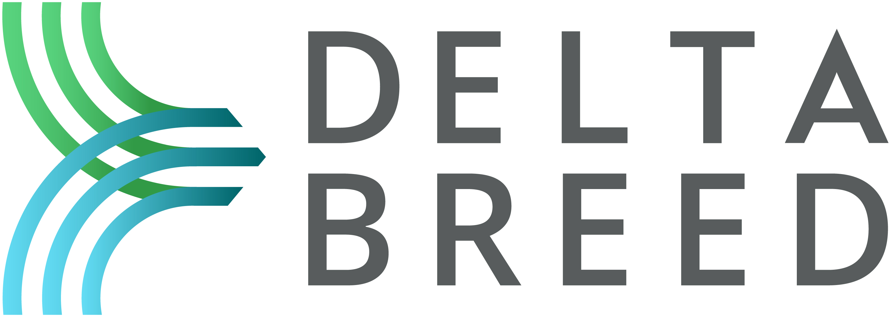

[](https://www.r-project.org/)
[](https://shiny.posit.co/)
[](https://www.apache.org/licenses/LICENSE-2.0)
[](https://github.com/josuechinchilla/TranslatoR/issues)
[](https://github.com/josuechinchilla/TranslatoR/pulls)
[](https://github.com/josuechinchilla/TranslatoR/releases/latest)

<div align="center">

</div>

### Bilingual DeltaBreed Import-Template Translator

TranslatoR is a Shiny web application developed by [Breeding Insight](https://breedinginsight.org/)
to switch [DeltaBreed](https://breedinginsight.org/learning-hub/deltabreed/) import
templates between Spanish and English. It lets breeding programs download bilingual
blank templates, read a bilingual field guide for every column, and convert a
completed template's Data-sheet headers between languages — so Spanish-speaking
users can prepare files that upload cleanly to DeltaBreed.

**Live app:** https://bi-science.shinyapps.io/TranslatoR/

## Overview

 TranslatoR provides an accessible and reproducible interface for:

- Downloading blank import templates in English or fully translated Spanish
- Understanding each Data-sheet column through a bilingual field guide
- Converting a completed template's headers between Spanish and English
- Working entirely in English or Spanish through a single language toggle

The application covers the four DeltaBreed import templates (Sample Submission,
Experiments, Ontology, and Germplasm). 

---

## Key Features

### Bilingual Blank Templates
- Download the upload-ready English original or a fully translated Spanish copy of any template
- Every worksheet is preserved (README, controlled-vocabulary lists, and Data)
- Spanish copies live in `inst/extdata/templates` and are served automatically.

### Bilingual Field Guide
- Collapsible, maximizable per-column reference for the Data sheet
- Shows the English header, the Spanish header, a description, and whether the column is required
- Switches language with the app-level toggle

### Header Converter
- Upload a completed `.xls`, `.xlsx`, or `.csv` and choose a direction (Spanish → English or English → Spanish)
- Only the Data-sheet header row is rewritten; all data rows and every other worksheet pass through untouched
- Accent- and case-insensitive matching, with unrecognized columns flagged and left as-is
- Excel in produces Excel out; CSV in produces CSV out
- Live mapping preview before download

### Bilingual Interface
- A single **English / Español** toggle localizes the whole interface: sidebar menu, field guides, notes, and buttons
- Built on a `bs4Dash` dashboard shell with a light sidebar and DeltaBreed-branded styling

---

## Installation and Running the App

TranslatoR uses a golem application structure, allowing it to be installed like a
standard R package.

### Install from GitHub

```r
if (!requireNamespace("remotes", quietly = TRUE)) {
  install.packages("remotes")
}
remotes::install_github("josuechinchilla/TranslatoR")
```

### Run TranslatoR
```r
TranslatoR::run_app()
```

### Dependencies
Key R packages used by TranslatoR include:

* shiny
* bs4Dash
* golem
* config
* readxl
* writexl
* pkgload

---

## Citation

If you use TranslatoR in your work, please cite it as:
Chinchilla-Vargas, J., & Breeding Insight Team (2026). TranslatoR: Bilingual DeltaBreed Import-Template Translator. R package version 0.0.0.9000. https://github.com/josuechinchilla/TranslatoR/

## License
TranslatoR is released under the Apache License, Version 2.0.
See the LICENSE file or https://www.apache.org/licenses/LICENSE-2.0 for details.

# Acknowledgments
TranslatoR is developed as part of the Breeding Insight initiative
(https://www.breedinginsight.org) to provide open-source, data-driven tools
for modern breeding programs.
